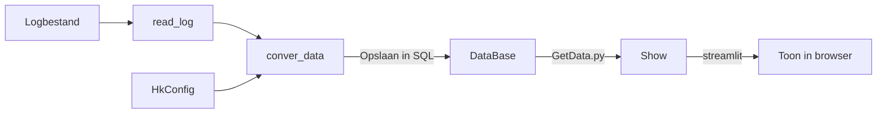

<!-- START doctoc generated TOC please keep comment here to allow auto update -->
<!-- DON'T EDIT THIS SECTION, INSTEAD RE-RUN doctoc TO UPDATE -->


- [🚈 HTM Logparser-systeem](#-htm-logparser-systeem)
  - [🔧 Omgevingsconfiguratie](#-omgevingsconfiguratie)
    - [Serverconfiguratie](#serverconfiguratie)
      - [Software installeren](#software-installeren)
    - [Benodigde pakketten](#benodigde-pakketten)
      - [Run (verwerking)](#run-verwerking)
      - [Show (visualisatie)](#show-visualisatie)
  - [📊 Structuuroverzicht](#-structuuroverzicht)
  - [📁 Bestandsoverzicht](#-bestandsoverzicht)
    - [HkConfig](#hkconfig)
    - [ReadAndSave](#readandsave)
    - [DataBase](#database)
    - [Analyze](#analyze)
    - [Run](#run)
    - [Show](#show)
  - [📂 Projectstructuur](#-projectstructuur)
    - [Doc](#doc)

<!-- END doctoc generated TOC please keep comment here to allow auto update -->

# 🚈 HTM Logparser-systeem

Intern Python-programma voor het automatisch analyseren van wissellogs binnen HTM Techniek. Het systeem decodeert hex-logs, converteert deze naar interpreteerbare statusinformatie en visualiseert alles via een webgebaseerde dashboard.

---

## 🔧 Omgevingsconfiguratie

### Serverconfiguratie

#### Software installeren

```bash
sudo apt update
sudo apt install python3-pip vim
pip install jupyterlab

# Jupyter configureren
jupyter-lab --generate-config
vim ~/.jupyter/jupyter_lab_config.py
c.ServerApp.allow_origin = '*'
c.ServerApp.ip = '*'
# Anaconda installeren
wget https://repo.anaconda.com/archive/Anaconda3-2021.11-Linux-x86_64.sh
bash Anaconda3-2021.11-Linux-x86_64.sh
source ~/.bashrc

# Streamlit installeren
conda install -c conda-forge streamlit
sudo vim /etc/systemd/system/jupyter-lab.service
[Unit]
Description=jupyter-lab
After=network.target

[Service]
Type=simple
User=sky
ExecStart=/home/sky/.local/bin/jupyter-lab
ExecStop=/usr/bin/pkill /home/sky/.local/bin/jupyter-lab
Restart=on-failure
RestartSec=30s

[Install]
WantedBy=multi-user.target
sudo systemctl daemon-reload
sudo systemctl enable jupyter-lab
sudo systemctl start jupyter-lab
```
### Benodigde pakketten

#### Run (verwerking)

- `sqlalchemy` – ORM-verbinding voor databaseopslag  
- `pandas` – voor dataframe-verwerking  
- `multiprocessing` – om parallelle verwerking te ondersteunen  
- `cryptocode` – voor versleuteling en decoding  
- `configparser` – voor .ini-bestandsinvoer  
- `re` – reguliere expressies voor loganalyse  

#### Show (visualisatie)

- `streamlit` – webgebaseerde dashboards en gebruikersinterface  
- `plotly` – interactieve grafieken  
- `fpdf` – genereren van PDF-rapporten  
- `tempfile` – tijdelijke bestandsopslag tijdens exports  

---

## 📊 Structuuroverzicht


## 📁 Bestandsoverzicht

### HkConfig

- `Config.py`  
  - `line_to_hex`: leest logbestand en splitst hex-codes in een lijst  
  - `list_to_str`: voegt lijst van hex-codes samen tot string  
  - `hex_to_bin`: zet hexadecimale codes om naar binaire vorm  
  - `convert_data`: vertaalt binaire status naar wisselstatus op basis van configbestand  
  - `wissel_version`: laadt correct configuratiebestand op basis van wisselnummer  

- `ImportIni.py`  
  - `bit_config`: zet statusbits om volgens .ini-bestand, gebruikt door `convert_data`  
  - `byte_config`: zet bytegegevens van voertuigen om via .ini-logica  

---

### ReadAndSave

- `ImportLog.py`  
  - `read_log`: leest ruwe loggegevens uit bestand  
  - `conver_data`: converteert logregels via HkConfig  
  - `mapping_df_types`: zet kolomtypes correct in pandas DataFrame  
  - `log_to_sql`: slaat verwerkte data op in een SQLite3 database  
  - `set_steps_denbdb3c`: herkent `denbdb3c` type wissels en hun status  
  - `process_log_sql`: volledige verwerking van één of meerdere logs  

- `VerSelect.py`  
  - `get_version`: geeft versienaam van een wissel-ID terug  
  - `get_wissel_type_nr`: haalt alle wissels op die tot een bepaald type behoren  

---

### DataBase

- `ConnectDB.py`  
  - `conn_engine`: maakt SQLAlchemy engine voor SQLite3 aan  
  - Verantwoordelijk voor lezen en schrijven van gegevens naar de database  

---

### Analyze

- `tram_speed.py`  
  - `voertuig_lent`: invoer voor tramlengtes per type  
  - `tram_speed_to_sql`: berekent snelheid van trams en schrijft naar database  

---

### Run

- `RunText.py`: hoofduitvoerscript voor testomgeving  
- `RunVM.py`: productie-uitvoering met logging en foutafhandeling  

---

### Show

- `Get_data.py`  
  - `get_tram_speed`: leest tramsnelheid uit database  
  - `create_download_link`: maakt downloadlink aan voor streamlit  

- `index.py`: startpunt voor het Streamlit-dashboard  
- `pages.py`: paginaconfiguratie voor een meerbladige UI in Streamlit  

---

## 📂 Projectstructuur
```text
+---DataBase
|   +---db
|   |       2022-06-16.db
|   |       
|   +---norm
|   |       gps_info.csv
|   |       steps.db
|   |       
|   +---snelheid
|   |       2022-07-05.db
|   |       
|   \---status
|           wissel_status.db
|           
+---log
|       20220616.log
|       
+---Run
|   +---bin
|   |       Rebuilt_dataBase.py
|   |       RunPupdate.py
|   |       RunPVM.py
|   |       RunP_concatDB.py
|   |       RunP_mergDB.py
|   |       RunP_mix_speed.py
|   |       RunP_mix_storing.py
|   |       RunRmDB.py
|   |       __init__.py
|   |       
|   +---conf
|   |   |   conf.py
|   |   |   denAHA4C.ini
|   |   
|   |   
|   |   |   
|   |   \---pipfiles
|   |           AI_storing_check.pkl
|   |           DTC_model.pkl
|   |           W003.pkl
|   |     
|   |           
|   \---core
|       +---Analyze
|       |       analyze_tool.py
|       |       check_storing_df.py
|       |       tram_speed.py
|       |       wissel_schakel.py
|       |       wissel_storing.py
|       |       wissel_vrij_list.py
|       |       __init__.py
|       |       
|       +---ConvertData
|       |       Config.py
|       |       ConnectDB.py
|       |       ImportConf.py
|       |       ReadLogs.py
|       |       VerSelect.py
|       |       
|       +---Integration
|       |       DataCalculator.py
|       |       DataInitialization.py
|       |       ProcessDataBase.py
|       |       __init__.py
|       |       
|       +---LogFilter
|       |       MountDir.py
|       |       __init__.py
|       |       
|       \---Tools
|               VaribleTool.py
|               __init__.py
|               
\---Show
    |   index.py
    |   pages.py
    |   __init__.py
    |   
    +---core
    |       GetData.py
    |       __init__.py
    |       
    \---sub_pages
        |   alldata.py
        |   intro.py
        |   rapportage.py
        |   storing.py
        |   tramspeed.py
        |   tramspeed_boxplot.py
        |   Utils.py
        |   wisselschakel.py
        |   __init__.py
        |   
        +---rapport_mode
        |       snelheid_rep.py
        |       storing_rep.py
        |       
        +---storing_mode
        |       allstoring.py
        |       storingdata.py
        |       unknowstoring.py
        |       
        \---tramspeed_mode
                fig_lijn.py
                fig_rit.py
                fig_voertuig.py
                fig_wagen.py
                fig_wissel.py
                max_waarde.py
                waarschuwing.py
```

### Doc

- Externe referentie:  
  - [Hands-on Machine Learning handleiding (NL)](https://hands1ml.apachecn.org/#)  
  - [Originele GitHub repo van het boek](https://github.com/ageron/handson-ml.git)

